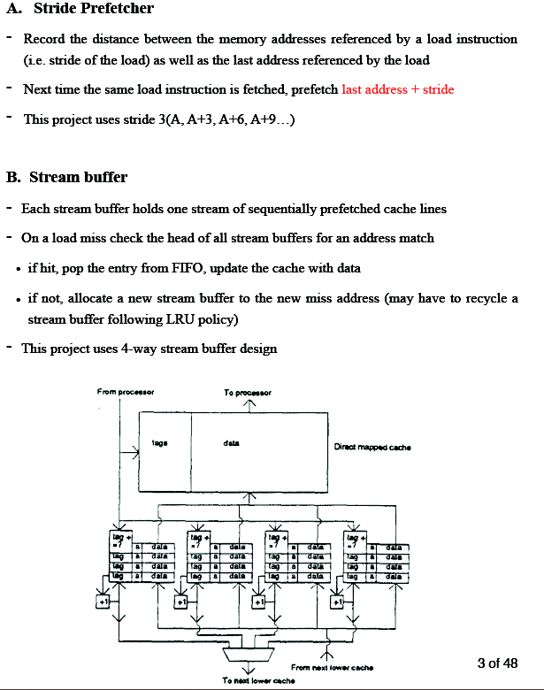

# Prefetch_Analyzer
3 Different Pre-fetching techniques performance analyzing

## Abstract
In this project, 3 types of prefetchers(Stride, Stream Buffer, Correlating) have been
implemented. Each prefetcher has their own mechanism from related papers, however,
basic concept of prefetching technique is same. The primary role of any prefetcher is to
predict future memory accesses so in this project, we are going to see how many
prefetched data will be hit. Hit count will be considered to be prediction of future
memory accesses. Basically, this project uses same cache memory system from project 2,
however, 1 more input is added for selecting prefetcher type. Example input argument
will be like:
```
‘gcc 10000000 0 16384 1 64 0 524288 1 64 0’
```
Next to 10000000 input argument designates prefetcher type(0 - Stride, 1 - Stream, 2 -
Correlating) so user can choose one of them to set a result. Rest of arguments are the
same from project 2. We use compile command as like:
```
‘gcc -o Project3.Grp1 Project3.Grp1.c -lm’
```

## Introduction
There are many types of prefetchers in Computer Architecture to predict next
fetching data. Among them, what we have implemented is Stride, Stream Buffer and
correlating buffer which so called ‘traditional’ prefetcher. Firstly, Stride prefetcher has
two kinds. One is ‘Instruction program counter’ and the other one is ‘Cache block
Address Based’. In this project, we only used the second kind of Stride prefetcher with
stride = 3. Secondly, Stream buffer is a buffer that holds one stream of sequentially
prefetched cache lines. If hit, pop the entry from FIFO, update the cache with data. If not,
allocate a new stream buffer to the new miss address following LRU replacement policy.
Finally, Tag correlating prefetcher is based on the idea that here is a strong correlation
between a tag and its preceding tags, and this correlation is highly repetitive. This
prefetcher uses only tag and index from memory address.

## Basic idea
<BR><BR>
